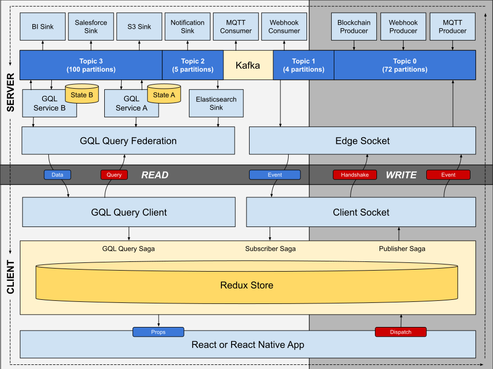

# SAMO

SAMO = same old shit -- is dead. A reference architecture dedicated to the work of [Jean-Michel Basquiat](https://en.wikipedia.org/wiki/Jean-Michel_Basquiat).

**Source**: [Sotheby's Auction](https://www.artsy.net/artwork/jean-michel-basquiat-back-of-the-neck)

## What

A microservice architecture organized around Kafka event streams.

### Important Properties

- Monorepo code organization 
- Separates reads and writes (inspired by [CQS](https://en.wikipedia.org/wiki/Command%E2%80%93query_separation))
- Realtime-first with [Socket.IO](https://socket.io/)
- Purifies code by describing [effects as data](https://medium.com/@philborlin/effects-as-data-5237f4beb11)
- Deploys to any kubernetes cluster with [skaffold](https://skaffold.dev/)

## Why

### Observable

When running any complex system, engineers are inevitably asked, "What happened?". We then attempt to coherently answer this question by piecing togther logs and error reports -- but this is more difficult than it needs to be. Rather, let's anticipate this question by building for observability from the start. To this end, SAMO takes an event-driven approach using Kafka on the backend and Redux Saga user action reporting on the front end.

### Testable

Engineers variously proxy system quality to metrics around test coverage. A better approach is to gauge *testability*. That is, how testable is the code we're writing? Code that lends itself to being tested is much more likely to actually be tested and meaningfully so. "Test-hostile" code and code which requires significant mocking suppresses test coverage and adds testing complexity. The use of mocks points to the presence of one or more side-effects in the system under test. We can step around this complexity by re-writing side-effects as data. That is, write side-effects as simple data messages to an effects processor. Code written this way can be tested almost exclusively using simple equality assertions.

### Composable

## Setup

- `export APP_NAME=samo` (set the APP_NAME to whatever you want)
- `./scripts/setup.sh`

## Develop

- `skaffold dev -p dev`

### View minikube dashboard

- `minikube dashboard` (separate terminal)

### AND/OR View k9s admin

- `k9s` (separate terminal)

### View Confluent Control Center UI

- [Port-foward Confluent control center](https://github.com/confluentinc/cp-helm-charts/blob/master/charts/cp-control-center/templates/NOTES.txt)

### Inteactive KSQL

- `kubectl get pods`
- `kubectl exec -it [name-of-the-ksql-pod] -c cp-ksql-server  -- /bin/bash ksql`
- `ksql`
- `list topics;`

## Teardown

- `./scripts/teardown.sh`

## Glossary

To better understand this architecture, let's define a few terms:

- **Edge Socket**: A dual-channel SocketIO socket exposed to clients.
- **Edge View**: A federated GraphQL endpoint exposing a unified, query-only interface to all views.
- **Effect**: An impure instruction which depends on or modifies external state.
- **Event**: A message sent from any socket or view. Some events can be broadcast to server-side or client consumers. They can be sent to all consumers, a namespace containing many consumers or an individual consumer.
- **Interpreter**: A subsystem which actually executes effects. This allows code to be written and tested without side-effects.
- **Query**: A normal GraphQL query.
- **Socket**: A dual-channel SocketIO socket exposed to the edge.
- **View**: A GraphQL endpoint exposing a particular slice of the graph.

## References

- [12 Factor App](https://12factor.net/)
- [Writing clean JS](https://github.com/ryanmcdermott/clean-code-javascript)
- [CQS](https://en.wikipedia.org/wiki/Command%E2%80%93query_separation)
- [Effects as data explanation](https://medium.com/@philborlin/effects-as-data-5237f4beb11)
- [Effects as data NodeJS implementation](https://github.com/orourkedd/effects-as-data)
- [K8s Cheatsheet](https://kubernetes.io/docs/reference/kubectl/cheatsheet/)
- [Lerna](https://lerna.js.org/)
- [Minikube on MacOS](https://minikube.sigs.k8s.io/docs/start/macos/)
- [Minikube](https://github.com/kubernetes/minikube)
- [Skaffold](https://skaffold.dev/)
- [Socket.IO](https://socket.io/)
- [Using Helm](https://helm.sh/docs/intro/using_helm/)
